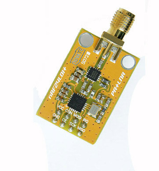
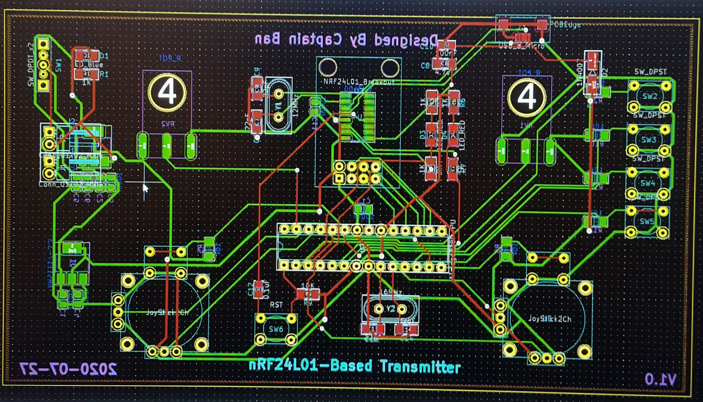
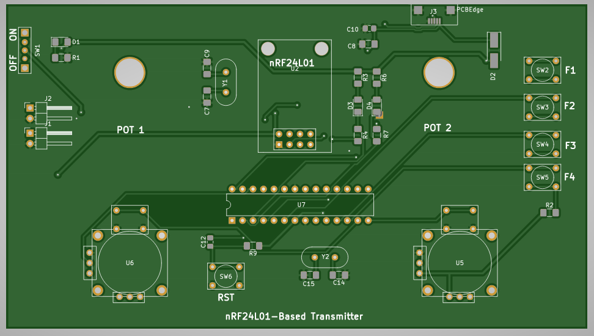
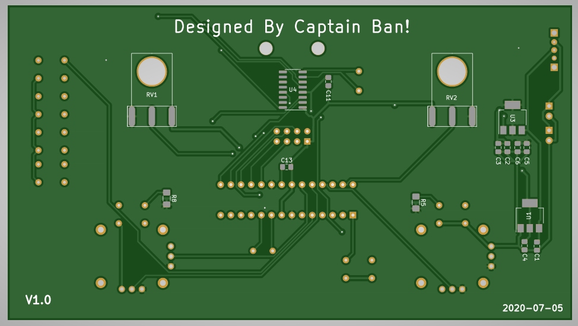
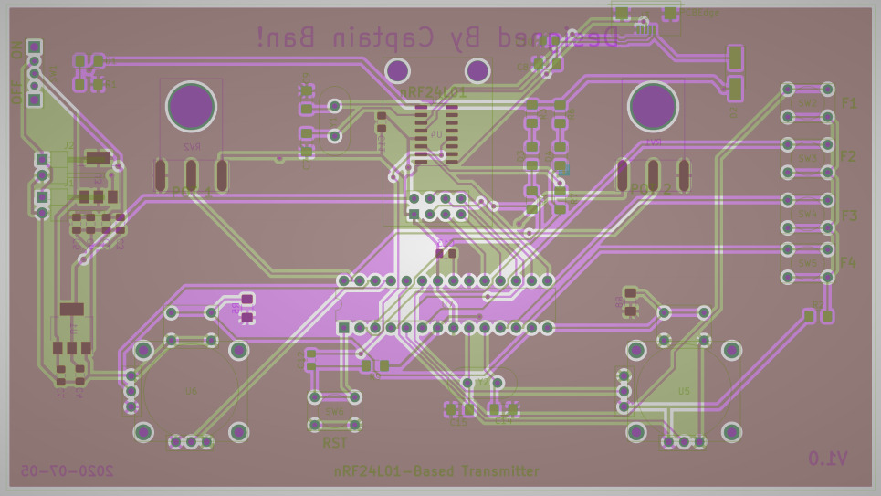

# Arduino n nRF24L01 Based Radio Controller PCB

>This is a Arduino Based Radio Controller PCB gerber files!
This has a usb-mini port on it that helps for programming or maybe sending Serial data into the computer.

### **Sorry, the Schematic is missing, but the components are writen down below:**

## Components:
1. PS4 Joysticks 2x (U5, U6)
2. Atmega328p Integrated Chip 1x (U7)
3. Potentiometers 2x (RV1, RV2)
4. Pushbuttons 5x (SW2 ~ SW6)
5. 16MHz Cystal 1x (Y2)
6. 10KOhms Resistors 5x (R2, R5, R6, R8, R9)
7. 1N4007 SMD diode 1x (D2)
8. small 1206 Green or RED power indicator LED 1x (D1)
9. 330 Ohm current limiting Resistor 3x (R1, R3, R6)
10. nRF24L01+ Chip 1x (Picture Below)
11. CH340G USB to Serial chip 1x (U4)
12. Serial transmission indicator 0805 red LED 2x (D3, D4)
13. 1k Ohm Resistors 2x (R4, R7)
14. 4.7uF Capacitor 0603 3x (C10, C11, C13)
15. 0.1uF Capacitor 0805 1x (C8)
16. 0.1uF Capacitor 0603 3x (C4, C6, C3)
17. 10nF Capacitor 0603 3x (C1, C5, C2)
18. SMD USB mini 1x (J3)
19. Pin headers male 4x (J1, J2)
20. 3 Pin on and off Switch 1x (SW1)
21. 20MHz Crystal 1x (Y1)
22. 22pF Caps 0805 4x (C14, C15, C7, C9)
23. LM1117 5.0v 1x (U3)
24. LM1117 3.3v 1x (U1)
25. 5mm Spacers for nRF chip 2x

> Specific nRF24L01 Chip with 1800m Range and 

 
> PCB KiCad View

> PCB Top View from gerber view

> PCB Bottom View from gerber view

> PCB Layers View from gerber view

## ***DESIGNED WITH KICAD!***